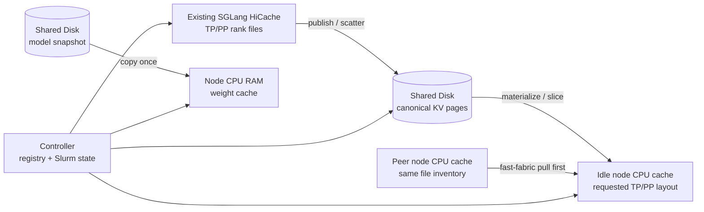

# SGLang KV and Weight Cache Orchestrator

This repository keeps persistent KV data on shared Disk and treats node-local
CPU RAM as a disposable cache. It also converts SGLang HiCache files through a
topology-neutral representation, so one model/prefix checkpoint can be reused
across compatible TP and PP layouts. Model weights remain authoritative on
shared Disk and can be copied once into each active node's `/dev/shm`, avoiding
repeated shared-filesystem reads during later server starts.



The placement policy is deliberately small:

1. Maximize exact KV-materialization hits.
2. Among equal KV choices, maximize topology-independent weight-cache hits.
3. Then prefer remaining booking lifetime and free `/dev/shm` capacity.
4. For a miss, optionally pull an exact file-layout match from another node's
   CPU cache over the configured fast-fabric route.
5. If no peer is valid or the transfer fails, materialize from authoritative
   shared Disk. If Disk has no canonical KV object yet, build through Prefill
   and publish it.

Workers are short-lived commands invoked over SSH; there is no resident cache
daemon. Peer transfer uses uncompressed rsync over SSH and verifies that the
resolved route uses the required interface before copying. This supports TCP
over RoCE or IPoIB while reporting the transport accurately rather than
claiming RDMA-verbs transfer.

The controller probes the requested cache path on eligible nodes, so a cache
that predates the registry or survives a controller restart is still reusable.

## Status

This is an alpha implementation for SGLang `HiCacheFile` with
`mem_layout=page_first` and ordinary MHA/GQA KV. MLA and TP layouts that
replicate KV heads are rejected rather than converted incorrectly.

## Install

```bash
python3 -m venv .venv
.venv/bin/pip install -e '.[dev]'
```

The controller and compute nodes must see the same checkout, normally through a
shared filesystem. By default the controller invokes this command remotely:

```text
PYTHONPATH=<checkout>/src python3 -m kv_cache_orchestrator.worker
```

Set `SGLANG_KV_WORKER_COMMAND` if the package is installed in a shared virtual
environment instead:

```bash
export SGLANG_KV_WORKER_COMMAND=/shared/venv/bin/sglang-kv-cache-worker
```

Other environment variables:

| Variable | Default | Purpose |
| --- | --- | --- |
| `SGLANG_KV_REGISTRY` | `~/.local/state/sglang-kv-cache-orchestrator/registry.json` | Canonical and local-cache metadata |
| `SGLANG_KV_DISK_ROOT` | `~/.cache/sglang-kv-cache-orchestrator/canonical` | Fallback canonical Disk root |
| `SGLANG_KV_LOCAL_ROOT` | `/dev/shm` | Safety boundary for node-local paths |
| `SGLANG_WEIGHT_CACHE_ROOT` | `/dev/shm/sglang-weight-cache` | Node-local model-cache root |

For a cluster deployment, set `checkpoint_store.disk_root` in each config to a
shared persistent filesystem and place the registry there as well.

## Config

The CLI accepts the existing replay JSON shape. See
[`examples/glm-gqa-tp4pp2.json`](examples/glm-gqa-tp4pp2.json). Prefixes can be
provided in either form:

```json
{
  "workload": {
    "prefixes": [
      {"token_ids": [1, 2, 3, 4]},
      {"token_file": "prefix.json"}
    ],
    "concurrency": 2,
    "routing": "round_robin"
  }
}
```

For compatibility with the Decode replay harness, omitting `prefixes` uses
`concurrency`, `input_tokens`, and `prompt_namespace` to regenerate its
deterministic token sequences.

Every prefix must be page aligned. PP greater than one requires an explicit
`layer_partition`. Rank order follows SGLang's `global_rank = pp_rank * TP +
tp_rank`; ranks are distributed uniformly across the listed nodes.

Enable node-local weights with:

```json
{
  "weight_cache": {
    "enabled": true,
    "local_root": "/dev/shm/sglang-weight-cache",
    "storage_min_free_space": "64G"
  }
}
```

Enable peer-first KV hydration with a Disk fallback:

```json
{
  "peer_transfer": {
    "enabled": true,
    "fabric_interface_regex": "^bond0(?:\\.|$)",
    "fallback_to_disk": true
  }
}
```

The controller searches every recorded materialization of the same canonical
checkpoint and accepts a peer only when file count, total bytes, and inventory
digest exactly match the target node. For replicated services, an instance may
set `cache_request_indices` (for example `[0]`) so the same canonical prefix is
materialized into more than one replica.

The weight fingerprint uses model revision, config/index digests, dtype, and
quantization, but no TP, PP, node, or KV-prefix fields. PP4 and TP4 therefore
reuse the same local model copy. `common.model` always remains the authoritative
shared-Disk path; a resolved config adds `weight_cache.runtime_model_path` for
the serving process.

## Commands

Inspect the two identities. The canonical fingerprint is independent of TP, PP,
node names, routing, and local cache paths; the materialization fingerprint is
not.

```bash
sglang-kv-cache fingerprint --config config.json
```

Publish a complete existing node cache to canonical Disk:

```bash
sglang-kv-cache --registry /shared/kv/registry.json \
  publish --config config.json --run-dir results/run-001
```

Inspect state, including the currently configured node caches:

```bash
sglang-kv-cache --registry /shared/kv/registry.json \
  status --config config.json --verify-disk-files
```

Plan placement without changing a config:

```bash
sglang-kv-cache --registry /shared/kv/registry.json \
  plan --config config.json --job-name-regex 'A100|H100'
```

Resolve nodes and hydrate Disk-backed misses:

```bash
sglang-kv-cache --registry /shared/kv/registry.json \
  prepare --config config.json --output resolved.json \
  --job-name-regex A100
```

Use `prepare --dry-run` to return the placement decision without writing or
loading any cache. `materialize` can also hydrate the nodes already named by a
config directly. If neither an exact local cache nor canonical Disk exists,
`prepare` returns `next_action=run_prefill_then_publish`; the serving harness
runs Prefill and then calls `publish`.

Inspect or explicitly populate the weight cache on nodes already named by a
config:

```bash
sglang-kv-cache weight-status --config resolved.json
sglang-kv-cache weight-materialize --config resolved.json
```

`prepare` performs the same weight materialization automatically. Population is
locked and atomic: workers copy into a staging directory, verify every file size
plus the model config/index hashes, then rename the complete object into place.
Later server starts still deserialize and transfer weights from CPU RAM to GPU;
the cache removes repeated shared-Disk reads rather than GPU load time itself.

## Correctness boundary

Reuse requires the same engine/file-format identity, model revision and weight
digests, dtype, page size, KV layout, and ordered prefix set. The target TP must
divide the model's KV-head count. The target PP partition must cover all layers
exactly. See [canonical format](docs/canonical-format.md) and
[architecture](docs/architecture.md) for details.

## Development

```bash
python3 -m pytest
python3 -m ruff check .
```

Tests use byte-exact synthetic pages and model files. They exercise PP4, TP4,
and TP2PP2 conversion in both directions, atomic weight copies, corruption
detection, capacity accounting, and cache-aware placement.
