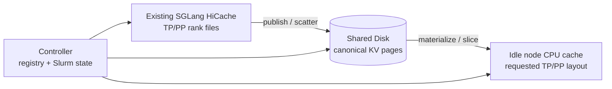

# SGLang KV Cache Orchestrator

This repository keeps persistent KV data on shared Disk and treats node-local
CPU RAM as a disposable cache. It also converts SGLang HiCache files through a
topology-neutral representation, so one model/prefix checkpoint can be reused
across compatible TP and PP layouts.



The placement policy is deliberately small:

1. Use an idle booked node that already has the exact requested materialization.
2. Otherwise use another idle booked node and materialize it from canonical Disk.
3. If Disk has no canonical object yet, build through Prefill and publish it.

There is no peer-to-peer cache copy, node-lifetime migration loop, or cache
daemon. Workers are short-lived commands invoked over SSH.

The controller probes the requested cache path on eligible nodes, so a cache
that predates the registry or survives a controller restart is still reusable.

## Status

This is an alpha implementation for SGLang `HiCacheFile` with
`mem_layout=page_first` and ordinary MHA/GQA KV. MLA and TP layouts that
replicate KV heads are rejected rather than converted incorrectly.

## Install

```bash
python3 -m venv .venv
.venv/bin/pip install -e '.[dev]'
```

The controller and compute nodes must see the same checkout, normally through a
shared filesystem. By default the controller invokes this command remotely:

```text
PYTHONPATH=<checkout>/src python3 -m kv_cache_orchestrator.worker
```

Set `SGLANG_KV_WORKER_COMMAND` if the package is installed in a shared virtual
environment instead:

```bash
export SGLANG_KV_WORKER_COMMAND=/shared/venv/bin/sglang-kv-cache-worker
```

Other environment variables:

| Variable | Default | Purpose |
| --- | --- | --- |
| `SGLANG_KV_REGISTRY` | `~/.local/state/sglang-kv-cache-orchestrator/registry.json` | Canonical and local-cache metadata |
| `SGLANG_KV_DISK_ROOT` | `~/.cache/sglang-kv-cache-orchestrator/canonical` | Fallback canonical Disk root |
| `SGLANG_KV_LOCAL_ROOT` | `/dev/shm` | Safety boundary for node-local paths |

For a cluster deployment, set `checkpoint_store.disk_root` in each config to a
shared persistent filesystem and place the registry there as well.

## Config

The CLI accepts the existing replay JSON shape. See
[`examples/glm-gqa-tp4pp2.json`](examples/glm-gqa-tp4pp2.json). Prefixes can be
provided in either form:

```json
{
  "workload": {
    "prefixes": [
      {"token_ids": [1, 2, 3, 4]},
      {"token_file": "prefix.json"}
    ],
    "concurrency": 2,
    "routing": "round_robin"
  }
}
```

For compatibility with the Decode replay harness, omitting `prefixes` uses
`concurrency`, `input_tokens`, and `prompt_namespace` to regenerate its
deterministic token sequences.

Every prefix must be page aligned. PP greater than one requires an explicit
`layer_partition`. Rank order follows SGLang's `global_rank = pp_rank * TP +
tp_rank`; ranks are distributed uniformly across the listed nodes.

## Commands

Inspect the two identities. The canonical fingerprint is independent of TP, PP,
node names, routing, and local cache paths; the materialization fingerprint is
not.

```bash
sglang-kv-cache fingerprint --config config.json
```

Publish a complete existing node cache to canonical Disk:

```bash
sglang-kv-cache --registry /shared/kv/registry.json \
  publish --config config.json --run-dir results/run-001
```

Inspect state, including the currently configured node caches:

```bash
sglang-kv-cache --registry /shared/kv/registry.json \
  status --config config.json --verify-disk-files
```

Plan placement without changing a config:

```bash
sglang-kv-cache --registry /shared/kv/registry.json \
  plan --config config.json --job-name-regex 'A100|H100'
```

Resolve nodes and hydrate Disk-backed misses:

```bash
sglang-kv-cache --registry /shared/kv/registry.json \
  prepare --config config.json --output resolved.json \
  --job-name-regex A100
```

Use `prepare --dry-run` to return the placement decision without writing or
loading any cache. `materialize` can also hydrate the nodes already named by a
config directly. If neither an exact local cache nor canonical Disk exists,
`prepare` returns `next_action=run_prefill_then_publish`; the serving harness
runs Prefill and then calls `publish`.

## Correctness boundary

Reuse requires the same engine/file-format identity, model revision and weight
digests, dtype, page size, KV layout, and ordered prefix set. The target TP must
divide the model's KV-head count. The target PP partition must cover all layers
exactly. See [canonical format](docs/canonical-format.md) and
[architecture](docs/architecture.md) for details.

## Development

```bash
python3 -m pytest
python3 -m ruff check .
```

Tests use byte-exact synthetic pages and exercise PP4, TP4, and TP2PP2 in both
directions.
